# HouseZero one-year dataset build pipeline

Builds a single wide, minute-resolution CSV (June 2024 – May 2025) for
[HouseZero](https://harvardcgbc.org/research/housezero/), the Harvard
CGBC ultra-low-energy office building, from the per-table CSVs
published on figshare, and fits LSTM twins of the zone thermal
dynamics.

Source: <https://doi.org/10.6084/m9.figshare.30260233>

## Run

```sh
./bootstrap.sh
```

Downloads per-table CSVs from figshare, merges them into one wide
`data.csv` with renamed canonical headers, and prints a summary.

Output: `data.csv`
Expected md5: `a819477def45d4d00e1ab3fdb6dc51bb`

## Files

| file | description |
|------|-------------|
| `build.py` | merge + rename |
| `roundtrip.py` | reconstruct per-table CSVs from `data.csv` and diff |
| `summary.py` | print rows / columns / span / group counts |
| `fit.py` | fit the nlLED twin from `data.csv` (GPU, ~30 min); an optional zone argument (e.g. `python fit.py Z31`) fits a single-zone model on that zone's air/slab temperatures driven only by weather (incl. facade temperature and wind) and its own valve and windows, saved as `fit.<zone>.pt` |
| `fit.pt` | trained joint-model checkpoint: cell/head weights, normalization constants (`ym ys um us zm zsd`), state/external names |
| `fit.<zone>.pt` | single-zone checkpoints (`fit.Z31.pt`, `fit.Z33.pt`), same layout as `fit.pt` but with that zone's two states and its own externals |
| `han_figs.py` | reproduce Figs 6–18 of Han et al. 2024 from `data.csv` (see below) |
| `rename.tsv` | `source_table  original  canonical` |
| `rubric.tsv` | `canonical  unit  short_desc  long_desc` |

## Single-zone models

Free-running rollout RMSE, air temperature, °F; externals: weather,
facade temperature, wind, own valve and windows.

| zone | year roll | val month | jan-roll |
|------|-----------|-----------|----------|
| Z31 | 1.22 | 1.38 | 1.18 |
| Z33 | 0.87 | 1.41 | 0.87 |

## Requirements

python3, pandas, curl.
`fit.py` additionally needs numpy, torch, holidays; it trains an LSTM
on the 37 zone air/slab temperatures driven by weather, the 19 valve
commands, and calendar inputs, saves `fit.pt`, and prints free-running
rollout checks (full year, held-out May 2025, January onward).
`han_figs.py` additionally needs matplotlib.

## Figures

The figures of the HouseZero data descriptor —
[Han et al. 2024](https://doi.org/10.1038/s41597-024-03770-7), which
describes the earlier two-year (2022–2024) release — reproduced from
this dataset by `han_figs.py`, with the paper's example dates shifted
into the June 2024 – May 2025 year.

Zone temperature, full year (paper Fig 6):

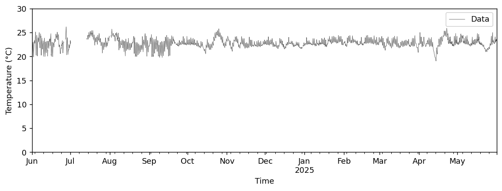

Zone temperature, summer window (Fig 7):

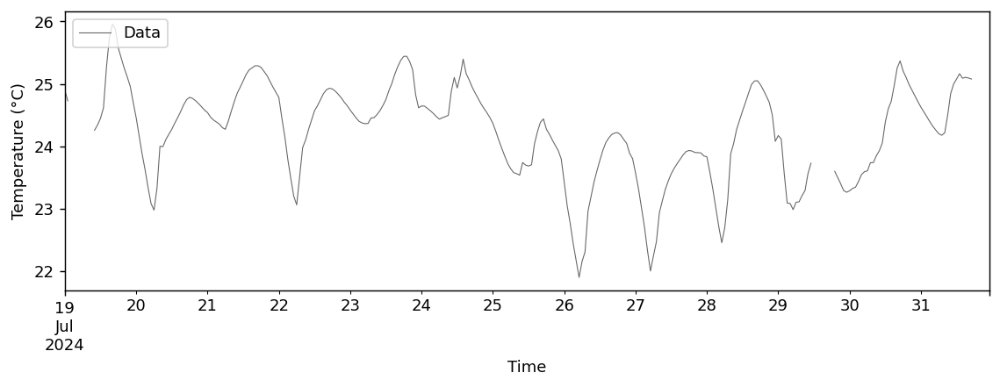

Annual electricity breakdown (Fig 8):

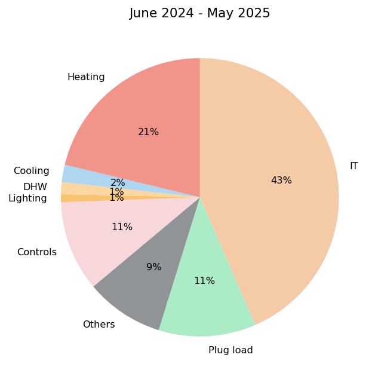

Daily pattern of electricity end uses, summer and winter day (Figs 9,
10):

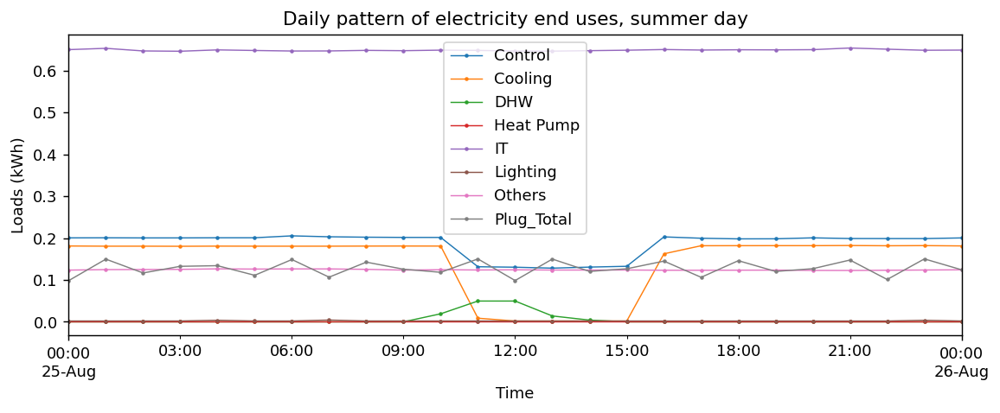
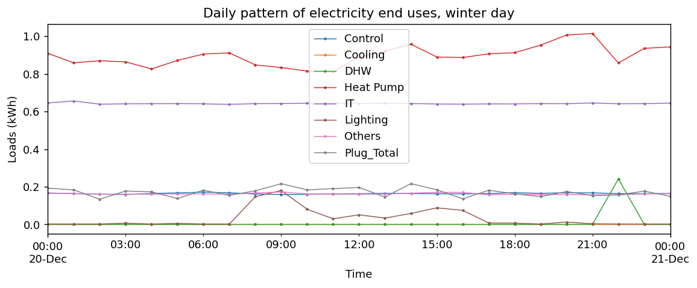

TABS BTU-meter energy by zone group, winter day (Fig 11):

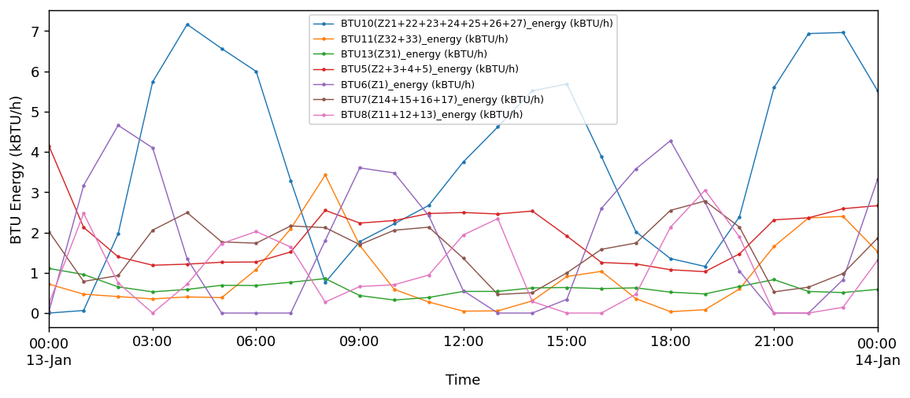

Zone CO2 and relative humidity, summer day (Figs 12, 13):

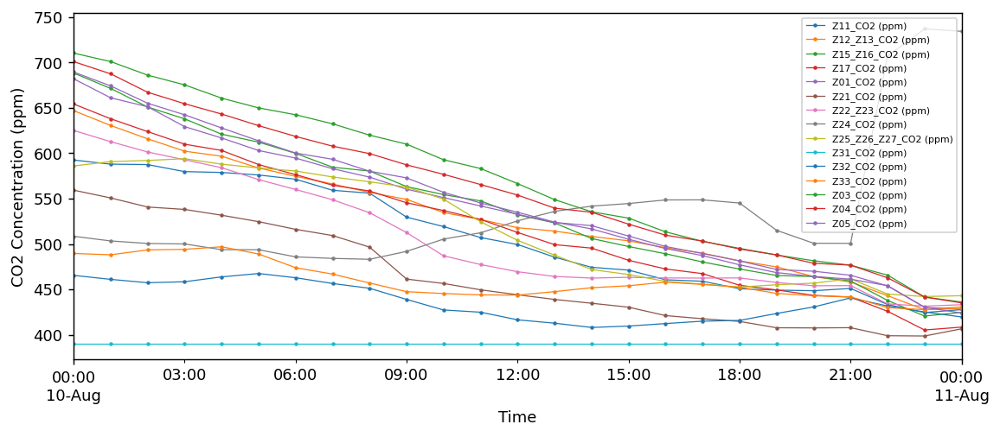
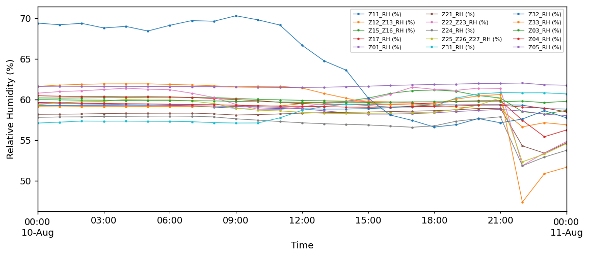

Natural ventilation, passive mode (Fig 14):

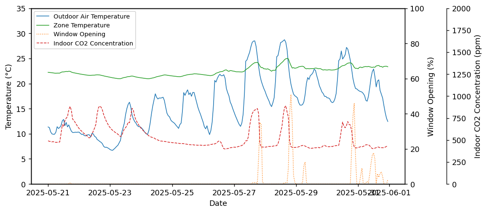

Monthly PV production vs. solar radiation (Fig 15):

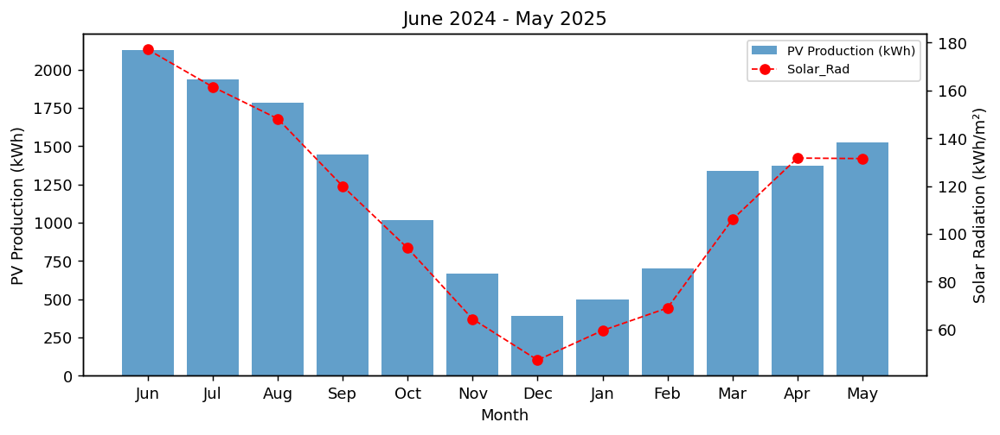

TABS operation, zone Z23, summer and winter day (Figs 16, 17):

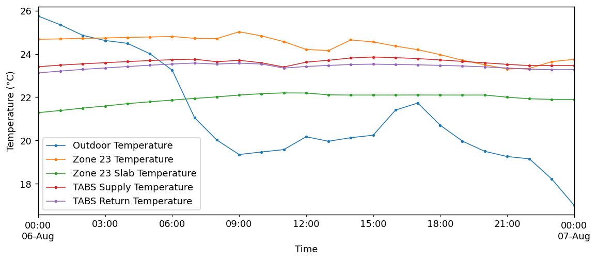
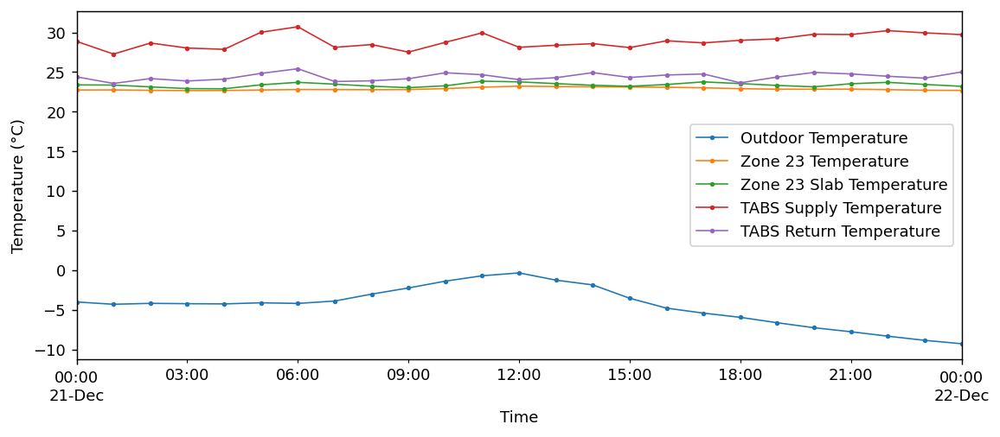

Heat-pump operation, winter day (Fig 18; partial — the paper's
House-Side temperature sensors are not in the released CSVs):

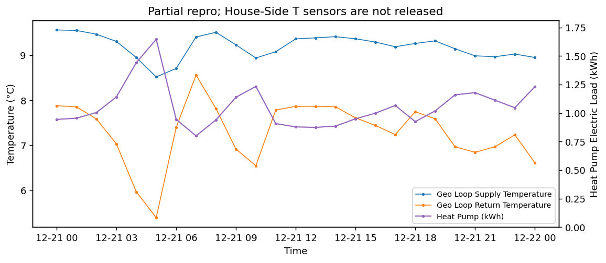
